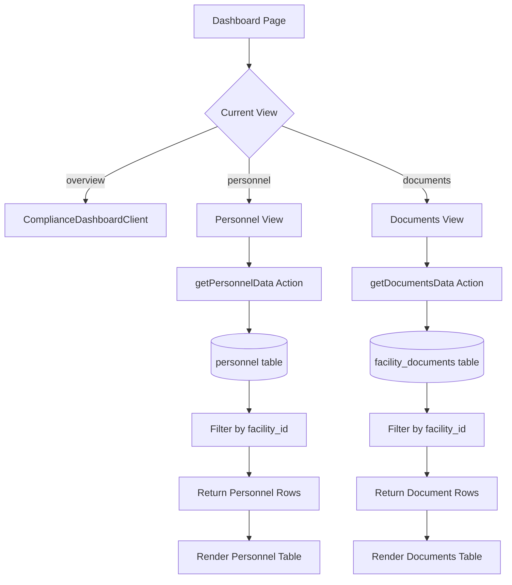
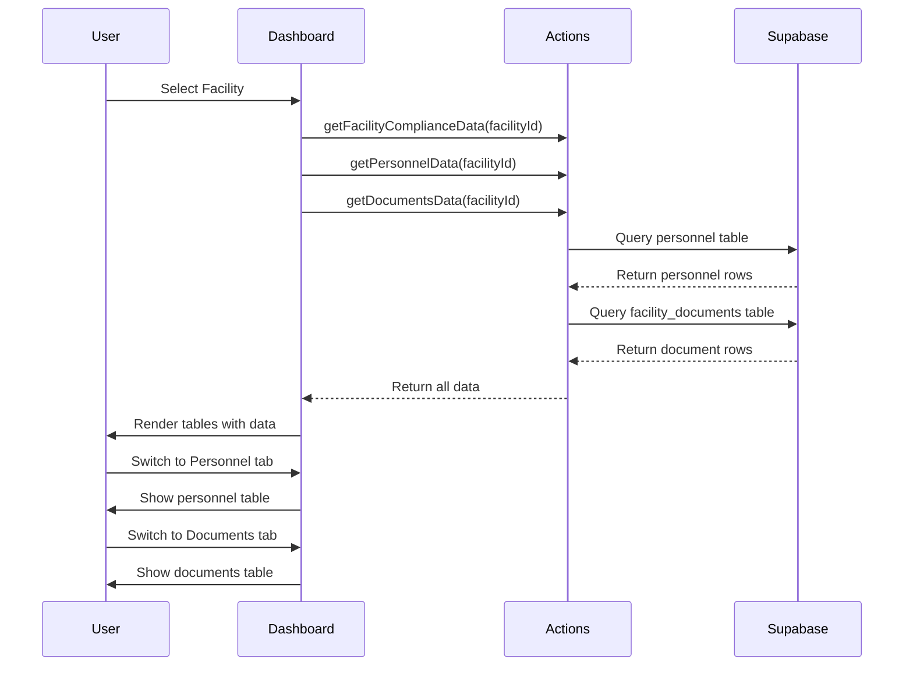

# Personnel & Documents Database Integration Plan

## Overview
Hook up the personnel and documents layout blocks in the dashboard to dynamically render data from the `personnel` and `facility_documents` database tables based on the active `selectedFacilityId`.

## Current State Analysis

### Existing Dashboard Structure
- **File**: [`src/app/dashboard/page.tsx`](src/app/dashboard/page.tsx:1)
- **Context**: Uses [`FacilityContext`](src/context/FacilityContext.tsx:1) to track `selectedFacilityId` and `currentView`
- **Views**: Three tabs - `overview`, `personnel`, `documents`
- **Current Implementation**: Personnel and documents views show placeholder content

### Database Schema

#### Personnel Table
```
personnel
├── id (uuid)
├── facility_id (uuid, foreign key)
├── name (text)
├── role (text)
├── clearance_status (text)
├── hire_date (date)
└── created_at (timestamp)
```

#### Facility Documents Table
```
facility_documents
├── id (uuid)
├── facility_id (uuid, foreign key)
├── document_type (text)
├── status (text: 'pending' | 'approved' | 'flagged')
├── file_url (text)
├── name (text)
├── metadata (jsonb)
└── created_at (timestamp)
```

## Architecture Design



## Implementation Steps

### Step 1: Create Server Actions for Data Fetching

**File**: [`src/app/actions/compliance.ts`](src/app/actions/compliance.ts:1)

Add two new server actions:

#### `getPersonnelData(facilityId: string)`
- Query `personnel` table filtered by `facility_id`
- Order by `hire_date DESC` (newest first)
- Return array of personnel records with all columns
- Handle errors gracefully with empty array fallback

#### `getDocumentsData(facilityId: string)`
- Query `facility_documents` table filtered by `facility_id`
- Order by `created_at DESC` (newest first)
- Return array of document records with relevant columns
- Handle errors gracefully with empty array fallback

### Step 2: Update Dashboard Page Data Loading

**File**: [`src/app/dashboard/page.tsx`](src/app/dashboard/page.tsx:1)

Modify the `loadStats()` function in the `useEffect` hook:
- Add calls to fetch personnel and documents data
- Store in separate state variables: `personnelData` and `documentsData`
- Load data alongside existing compliance data
- Maintain loading states for smooth UX

### Step 3: Create Personnel Table UI Component

**Location**: Inline in dashboard page (lines 89-97)

Replace placeholder with:
- Responsive table layout with proper styling
- Columns: Name, Role, Clearance Status, Hire Date
- Status badges with color coding:
  - `approved` → Green badge
  - `pending` → Yellow badge
  - `flagged` → Red badge
- Empty state message when no personnel records exist
- Consistent styling with existing dashboard components

### Step 4: Create Documents Table UI Component

**Location**: Inline in dashboard page (lines 99-107)

Replace placeholder with:
- Responsive table layout matching personnel style
- Columns: Document Name, Type, Status, Upload Date
- Status badges with same color scheme as personnel
- Link to view/download documents (if applicable)
- Empty state message when no documents exist
- Show metadata information in expandable rows (optional enhancement)

### Step 5: Styling & UX Enhancements

Apply consistent styling:
- Use existing Tailwind classes from [`ComplianceDashboardClient`](src/components/ComplianceDashboardClient.tsx:1)
- Maintain slate color palette and border styles
- Add hover effects on table rows
- Ensure responsive design for mobile devices
- Add loading skeletons during data fetch

### Step 6: Update Personnel Count in Overview

**File**: [`src/lib/reg-monitor.ts`](src/lib/reg-monitor.ts:150)

Update the `getRegulatoryStatus` function:
- Query actual count from `personnel` table
- Replace hardcoded `staffCount: 0` with real data
- Filter by `facility_id` parameter

## Data Flow Diagram



## Type Definitions

```typescript
// Personnel record type
interface PersonnelRecord {
  id: string;
  facility_id: string;
  name: string;
  role: string;
  clearance_status: string;
  hire_date: string;
  created_at: string;
}

// Document record type
interface DocumentRecord {
  id: string;
  facility_id: string;
  document_type: string;
  status: 'pending' | 'approved' | 'flagged';
  file_url: string;
  name: string;
  metadata: Record<string, any>;
  created_at: string;
}
```

## Error Handling Strategy

1. **Database Query Failures**: Return empty arrays, log errors to console
2. **Missing Facility ID**: Show appropriate empty state message
3. **Network Issues**: Display retry button or error message
4. **Type Mismatches**: Use TypeScript strict mode to catch at compile time

## Testing Checklist

- [ ] Personnel data loads correctly for selected facility
- [ ] Documents data loads correctly for selected facility
- [ ] Empty states display when no data exists
- [ ] Loading states show during data fetch
- [ ] Tab switching works smoothly
- [ ] Facility selector updates both views
- [ ] Status badges display correct colors
- [ ] Responsive design works on mobile
- [ ] No TypeScript compilation errors
- [ ] No console errors in browser

## Build Verification

Run the following command to verify no errors:
```bash
npm run build
```

Expected output: Successful build with no errors or warnings.

## Files to Modify

1. [`src/app/actions/compliance.ts`](src/app/actions/compliance.ts:1) - Add new server actions
2. [`src/app/dashboard/page.tsx`](src/app/dashboard/page.tsx:1) - Update data loading and UI
3. [`src/lib/reg-monitor.ts`](src/lib/reg-monitor.ts:150) - Update personnel count

## Success Criteria

✅ Personnel table displays all employee records for selected facility
✅ Documents table displays all document records for selected facility
✅ Data updates when facility selection changes
✅ Status badges show correct colors based on clearance/approval status
✅ Empty states display appropriately
✅ Build completes without errors
✅ UI matches existing dashboard styling and patterns
